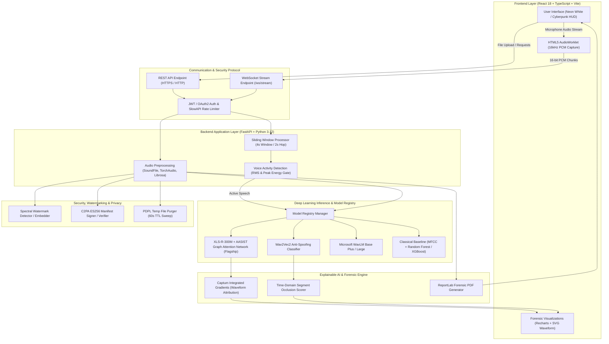
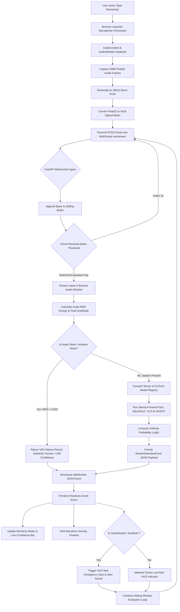
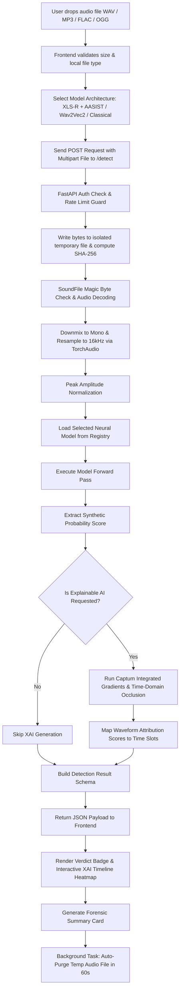
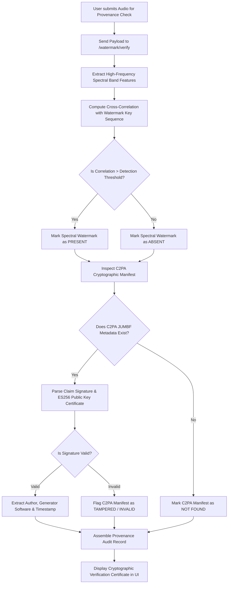

# REPLICA — System Architecture & Data Flowcharts

This document provides a comprehensive technical overview of **REPLICA (VoiceGuard AI Voice Security & Speech Forensics Platform)**, including high-level system architecture and step-by-step data flowcharts.

---

## 1. System Architecture Diagram

---

## 2. Real-Time Live Streaming Detection Flowchart

This flowchart details how microphone audio is captured, chunked, transmitted, and evaluated continuously in the **Live Monitoring Section**.

---

## 3. Audio File Upload Detection & XAI Attribution Flowchart

This flowchart outlines what happens when a user uploads a pre-recorded audio file in the **Detect Section**.

---

## 4. Watermarking & Provenance Verification Flowchart

This flowchart illustrates the dual-layer watermarking and C2PA cryptographic provenance verification process in the **Verify Section**.

---

## 5. Summary Table: Component Interaction Matrix

| Layer / Module | Technologies | Key Responsibilities |
| :--- | :--- | :--- |
| **Frontend** | React 18, TypeScript, Vite, TailwindCSS | User interactions, Neon White / HUD themes, dynamic SVG audio visualization, WebSockets. |
| **Audio Worklet** | HTML5 Web Audio API | Low-latency audio capture, 16kHz downsampling, 16-bit PCM binary chunking. |
| **Backend API** | FastAPI, Python 3.12, Uvicorn | REST endpoints (`/detect`, `/explain`), WebSocket streaming (`/ws/stream`), auth & rate limiting. |
| **Audio Pipeline** | SoundFile, Librosa, TorchAudio | Audio decoding, channel downmixing, VAD energy gating, normalization, MFCC feature extraction. |
| **Model Engine** | PyTorch, Transformers, ONNX | Forward inference on XLS-R-300M, AASIST, Wav2Vec2, WavLM, and XGBoost models. |
| **XAI Engine** | Captum, SHAP, Scipy | Integrated Gradients, segment occlusion scoring, spectral frequency attribution maps. |
| **Provenance** | C2PA, Cryptography, ReportLab | Spectral watermark generation/detection, ES256 C2PA manifest verification, NIST PDF generation. |
