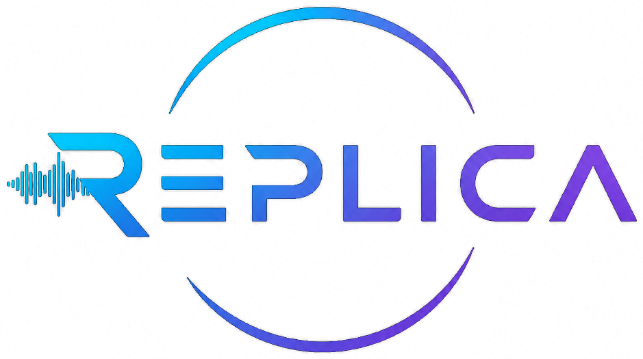
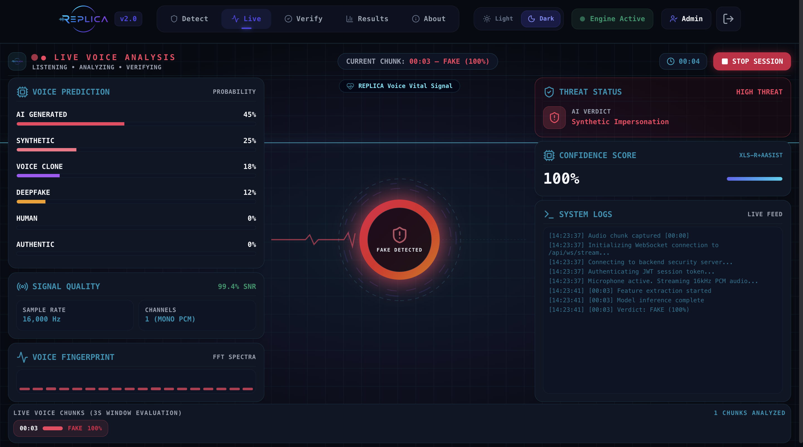
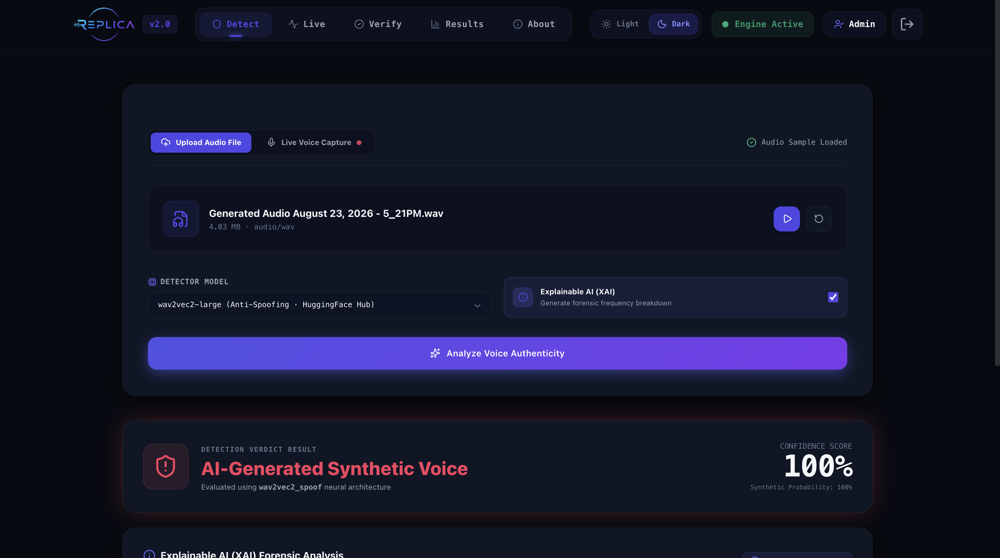
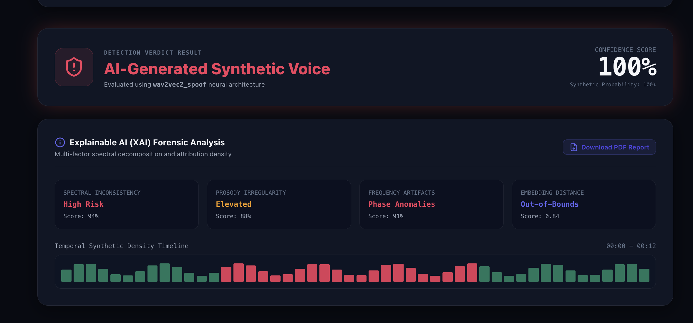
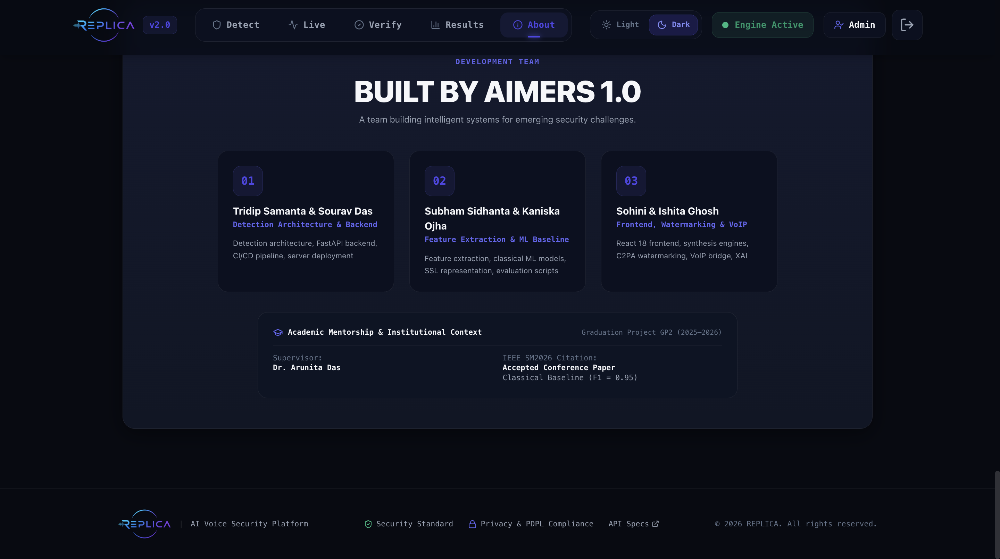
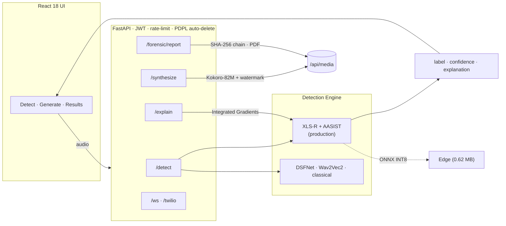

<div align="center">



# REPLICA

**AI voice security platform for real-time deepfake detection, synthesis watermarking, forensic analysis, and vishing defense.**

[](https://github.com/tridipsamanta/REPLICA-AI/actions/workflows/ci.yml)
[](LICENSE)
[](https://www.python.org)
[](https://fastapi.tiangolo.com)
[](https://react.dev)
[](https://pytorch.org)
[](https://github.com/astral-sh/ruff)
[](CONTRIBUTING.md)
[](#-citation)

[**▶ Watch demo video**](https://youtu.be/D_FcnXMhvtc?si=oZ3hIpx_A3jRhZOm) ·
[**🌐 Live deployment**](https://voice-deepfake-vishing-detector-generator.eu.cc) ·
<a href="#-quick-start">Quick start</a> ·
<a href="#-results">Results</a> ·
<a href="#-architecture">Architecture</a> ·
<a href="#-api">API</a> ·
<a href="#-documentation">Docs</a> ·
<a href="CONTRIBUTING.md">Contributing</a>

</div>

---

## Why REPLICA?

AI voice cloning has turned phone fraud into a scalable weapon. In 2024 criminals
stole **US$25M** from a company using a deepfaked CFO on a video call, and reported
voice-phishing ("vishing") incidents **surged over 1,600%** in early 2025. Off-the-shelf
detectors collapse on *real-world* audio — phone codecs, background noise, and unseen
TTS engines — and offer no explanation a human analyst can act on.

**REPLICA** is an end-to-end platform that detects voice deepfakes in real time,
explains its decisions, watermarks any audio it generates, and ships small enough to
run at the edge. Built by **Aimers 1.0** as a Graduation Project GP2 (2025–2026); the
classical baseline was accepted at **IEEE SM2026**.

## ✨ Features

- 🛡️ **Detection** — production **XLS-R-300M + AASIST** model (official ASVspoof 2021 LA eval EER **2.84%**, v9c) that *also* catches modern voice clones and premium TTS, with DSFNet, Wav2Vec2/WavLM, and a classical XGBoost baseline all selectable. An input-quality guard rejects silent / too-short clips instead of guessing.
- 🌍 **Real-world robustness** — hardened against out-of-distribution TTS engines and noisy / telephony / short audio, with the limits *measured and documented*, not hidden (see [Results](#-results)).
- 🎙️ **Live microphone streaming** — the web app's **Live tab** streams your mic over WebSocket and shows a live real/fake verdict that re-scores the session from its start as more audio arrives (first verdict at 3s; see [docs/KNOWN_LIMITATIONS.md](docs/KNOWN_LIMITATIONS.md) for why not sliding windows).
- 🔍 **Explainability** — Integrated-Gradients attribution shows *which moments* drove the verdict.
- 🗣️ **Synthesis + watermarking** — multi-engine Generate: local **Kokoro-82M** preset voices and optional **zero-shot voice cloning** (XTTS v2 / IndexTTS-2, admin-only) from a reference clip; every clip is spectrally watermarked as AI-generated and C2PA-signed. The **Verify tab** (`POST /watermark/verify`) closes the loop: prove any clip's provenance back. See [docs/SYNTHESIS_ENGINES.md](docs/SYNTHESIS_ENGINES.md).
- 🧾 **Forensics** — SHA-256 chain-of-custody and NIST SP 800-86 PDF reports.
- ☎️ **VoIP** — Twilio Media Streams bridge for live call screening.
- ⚡ **Edge-ready** — ONNX INT8 export at **0.62 MB**, **~30 ms** CPU inference.

## 🎬 Demo

Watch the REPLICA walkthrough on YouTube: **[REPLICA demo video](https://youtu.be/D_FcnXMhvtc?si=oZ3hIpx_A3jRhZOm)**.

<p align="center">
  <a href="https://youtu.be/D_FcnXMhvtc?si=oZ3hIpx_A3jRhZOm">
    
  </a>
</p>

End-to-end flow: log in as an analyst, stream or upload audio, detect synthetic speech,
review the confidence score, and inspect explainable forensic evidence.

| Live Voice Analysis | Detection Result |
|:-------------------:|:----------------:|
|  |  |

| XAI Forensic Analysis | Development Team |
|:---------------------:|:----------------:|
|  |  |

## 📊 Results

The deployed detector — **XLS-R-300M + AASIST "v9c"** — is selected for *overall* performance,
not the lowest headline EER: a checkpoint with a lower official EER (v8, 2.49%) was **rejected**
for deployment because it is blind to modern voice clones.

| Benchmark | Result |
|-----------|--------|
| **Official ASVspoof 2021 LA eval** (181,566 trials) | **2.84% EER** [95% CI 2.67–3.02] |
| Real-audio pass rate (held-out, speaker/text-disjoint) | **96%** |
| Kokoro voice-clone detection (held-out, 100/family) | **100%** |
| XTTS v2 voice-clone detection | **100%** |
| IndexTTS-2 voice-clone detection | **97%** |
| **ElevenLabs-v3** — engine *never seen* in training | **95.8%** |

| Edge & provenance | Result |
|-------------------|--------|
| DSFNetTiny INT8 model size | **0.62 MB** |
| CPU inference latency (p50) | **~30 ms** |
| Edge model EER (trained weights) | 8.47% |
| Synthesized audio provenance | signed **C2PA manifest** + spectral watermark |

<details>
<summary><b>Model lineage — why you may spot other EERs (2.61 / 2.49 / 3.38) in this repo</b></summary>

| Model | EER (eval) | EER (full-pool) | Catches clones | Catches premium TTS | Role |
|-------|:----------:|:---------------:|:--------------:|:-------------------:|------|
| **XLS-R + AASIST — v9c** | **2.84%** | 8.21% | ✓ all ≥97% | ✓ ElevenLabs 96% | 🏆 **deployed** |
| XLS-R + AASIST — v7 | 3.38% | 8.60% | ✓ all ≥96.7% | ✗ (85%) | previous production |
| XLS-R + AASIST (Kokoro-parent) | 2.61% | 8.21% | ✗ | ✗ | EER-only headline |
| XLS-R + AASIST — v8 | 2.49% | 9.91% | ✗ (Kokoro 62.5%) | — | lowest official EER |
| Wav2Vec2-large | 3.09% | 7.07% | — | — | baseline |

**On the "2.61%".** That figure is the **Kokoro-parent** checkpoint on the official
eval — **reproduced exactly from raw FLAC on 2026-06-09** (`run_official_eval.py`) — but
it does *not* catch modern clones. The deployed lineage (v7 → v9c) is measured on the
same official protocol: **v7 = 3.38%**, **v9c = 2.84%**. v9c recovers most of the EER
gap *and* catches clones + premium TTS, so it's the best model overall.

</details>

> **🔬 Reproducible & honestly bounded.** Every EER carries a 95% bootstrap CI, on a
> single provenance-tagged table, with same-protocol baselines and a fixed env manifest —
> and the hard limits are *measured*, not hidden. See the full
> [documentation index](#-documentation) below.

### Evidence and license scope

The headline results are not standalone claims. Start with [`docs/RESULTS_canonical.md`](docs/RESULTS_canonical.md) for the checkpoint identifier, dataset/protocol, confidence interval, and provenance record; use [`docs/EVAL_PROTOCOLS.md`](docs/EVAL_PROTOCOLS.md) for the exact evaluation path; and use [`docs/REPRODUCIBILITY_MANIFEST.md`](docs/REPRODUCIBILITY_MANIFEST.md) to reproduce the pinned environment. The deployment decision for v9c is documented in the model-lineage table above: the lowest official EER was not selected because it failed the clone- and premium-TTS-robustness requirement.

The repository code and original documentation are released under the [Apache License 2.0](LICENSE). That license does not automatically relicense third-party checkpoints, datasets, pretrained backbones, synthesis engines, fonts, images, or other bundled material. Check the relevant upstream license and attribution terms before redistributing those components or publishing a derived model. Dataset access and evaluation use must also follow the terms of the respective dataset providers.

## 🏗️ Architecture



<details>
<summary><b>📁 Repository layout</b></summary>

```
REPLICA-AI/
├── src/voiceguard/        # Python package
│   ├── api/               #   FastAPI app — auth (JWT/roles), routes, middleware, WebSockets
│   ├── models/            #   XLS-R+AASIST, DSFNet, Wav2Vec2/WavLM, classical baseline
│   ├── features/          #   acoustic feature extraction
│   ├── preprocessing/     #   resampling, augmentation (RawBoost), input-quality guard
│   ├── training/          #   training loops & schedules
│   ├── evaluation/        #   EER / minDCF scoring, bootstrap CIs
│   ├── synthesis/         #   Kokoro-82M, XTTS v2, IndexTTS-2 engines
│   ├── watermark/         #   spectral watermark embed/verify + C2PA signing
│   ├── forensics/         #   SHA-256 chain-of-custody, NIST SP 800-86 PDF reports
│   ├── voip/              #   Twilio Media Streams bridge
│   └── xai/               #   Integrated-Gradients attribution
├── frontend/              # React 18 + Vite + Tailwind web app
├── edge/                  # 0.62 MB ONNX INT8 runtime (onnxruntime + numpy, no torch)
├── integrations/iped/     # IPED digital-forensics pipeline add-on
├── deploy/                # Nginx + systemd deployment scripts, demo recorder
├── docs/                  # results, protocols, limitations, reproducibility
└── tests/                 # 147 tests (pytest)
```

</details>

## 🚀 Quick start

```bash
git clone https://github.com/tridipsamanta/REPLICA-AI.git
cd REPLICA-AI

# Backend (Python 3.12)
python3 -m venv venv && source venv/bin/activate
pip install -e .

PYTHONPATH=src SECRET_KEY="$(openssl rand -hex 32)" \
  uvicorn voiceguard.api.main:app --host 127.0.0.1 --port 8000
# API docs → http://127.0.0.1:8000/docs   (demo login: admin / voiceguard2026)

# Frontend (in another shell)
cd frontend && npm ci && npm run dev
```

The production detector (`xls_r_aasist`) needs a ~1.2 GB checkpoint (not in git);
without it, set `model=classical` or point `XLS_R_AASIST_PATH` at the checkpoint.

**Docker Compose:** `docker compose up --build` serves everything on `http://localhost`,
mounts `./checkpoints` into the backend (drop the checkpoint at
`checkpoints/xls_r_aasist/model_best.pt` or export `XLS_R_AASIST_PATH`), and falls
back to the classical baseline when no checkpoint is present.
Self-hosted deployment (Nginx + systemd) is scripted in [`deploy/`](deploy/).

### Three ways to run it

| Mode | What | Install |
|------|------|---------|
| 🌐 **Web app / API** | Full SSL model **v9c** (catches clones + premium); live deployment + REST API | this Quick start, the [live deployment](https://voice-deepfake-vishing-detector-generator.eu.cc), or the [demo video](https://youtu.be/D_FcnXMhvtc?si=oZ3hIpx_A3jRhZOm) |
| 🔬 **IPED forensic add-on** | Flags deepfake audio inside the [IPED](https://github.com/sepinf-inc/IPED) evidence pipeline (a capability IPED lacks) | [`integrations/iped/`](integrations/iped/) |
| 🍓 **Raspberry Pi / edge** | 0.62 MB INT8 model, CPU-only, `onnxruntime`+`numpy`+`soundfile` (no torch) | [`edge/`](edge/) |

## ⚙️ Configuration

Everything is configured via environment variables; sensible defaults make local
development zero-config.

| Variable | Default | Purpose |
|----------|---------|---------|
| `SECRET_KEY` | dev placeholder | JWT signing key — **set in production** (`openssl rand -hex 32`) |
| `VG_ENV` | `development` | `production` enforces strict auth & Twilio signature checks |
| `XLS_R_AASIST_PATH` | — | Path to the production detector checkpoint |
| `VG_ADMIN_PASSWORD` / `VG_ANALYST_PASSWORD` | demo creds | Override the built-in demo users |
| `FRONTEND_ORIGIN` / `FRONTEND_ORIGINS` | — | CORS allowlist for the web app |
| `PDPL_MAX_AGE_SECONDS` | `60` | Auto-delete window for uploaded audio (PDPL compliance) |
| `VG_MAX_AUDIO_SECONDS` | `600` | Maximum accepted upload length |
| `VG_MEDIA_TTL_S` | `900` | TTL for generated/watermarked media |
| `VG_CLONE_QUOTA_PER_HOUR` | `10` | Per-admin voice-cloning quota |
| `VG_WS_MAX_CONNECTIONS` | `4` | Concurrent live-mic streaming slots |
| `TWILIO_AUTH_TOKEN` | — | Enables `X-Twilio-Signature` validation on the VoIP bridge |

## 🔌 API

| Method | Endpoint | Description | Auth |
|--------|----------|-------------|:----:|
| `POST` | `/token` | OAuth2 password → JWT (carries a `role` claim) | — |
| `POST` | `/detect` | Audio → verdict (`?model=`, `?explain=true`) | 🔑 |
| `POST` | `/explain` | Integrated-Gradients attribution | 🔑 |
| `POST` | `/synthesize` | Text → watermarked speech (voice *cloning* is admin-only + quota'd) | 🔑 |
| `POST` | `/watermark/verify` | Provenance check: spectral watermark + C2PA manifest | 🔑 |
| `POST` | `/forensic/report` | NIST SP 800-86 PDF report (audio metadata, model + checkpoint hash) | 🔑 |
| `WS` | `/ws/stream` | Live-mic streaming (JWT as first WS message; capped slots) | 🔑 |
| `WS` | `/twilio/stream` | Twilio call screening (`X-Twilio-Signature` when `TWILIO_AUTH_TOKEN` set) | ✍️ |
| `GET` | `/models` · `/health` · `/docs` | Ops & Swagger | — |

🔑 JWT bearer · ✍️ Twilio request signature (open in development; refused in
production unless `TWILIO_AUTH_TOKEN` is configured)

## 🧪 Testing & quality

**147 tests** across 17 modules — API auth & security hardening, watermark round-trip,
C2PA signing, forensics chain-of-custody, XAI, adversarial robustness, RawBoost
augmentation, and a simulated Twilio call stream. CI runs the suite plus `ruff`
(lint + format) and `bandit` (security static analysis) on every push.

```bash
pip install -e ".[dev]"
pytest --cov=src/voiceguard tests/
ruff check src/ tests/
```

## 📖 Documentation

| Document | What's inside |
|----------|---------------|
| [RESULTS_canonical.md](docs/RESULTS_canonical.md) | **Single source of truth** for every EER — auto-generated, 95% bootstrap CIs, minDCF, provenance per checkpoint |
| [EVAL_PROTOCOLS.md](docs/EVAL_PROTOCOLS.md) | Evaluation protocols & how to reproduce every number |
| [ADVERSARIAL_ROBUSTNESS.md](docs/ADVERSARIAL_ROBUSTNESS.md) | PGD attack curve — measured adversarial limits |
| [HIDDEN_TRACK_ANALYSIS.md](docs/HIDDEN_TRACK_ANALYSIS.md) | Where residual error concentrates (hard OOD track) |
| [CLONE_DETECTION_LIMITS.md](docs/CLONE_DETECTION_LIMITS.md) | Measured boundaries of clone detection |
| [KNOWN_LIMITATIONS.md](docs/KNOWN_LIMITATIONS.md) | Honest platform limitations (streaming, latency, scope) |
| [SYNTHESIS_ENGINES.md](docs/SYNTHESIS_ENGINES.md) | Kokoro / XTTS v2 / IndexTTS-2 engine guide |
| [REPRODUCIBILITY_MANIFEST.md](docs/REPRODUCIBILITY_MANIFEST.md) | Fixed environment manifest for all reported results |
| [EVALUATION_METADATA.md](docs/EVALUATION_METADATA.md) | Dataset identity, artifact hashes, commands, result fields, and licensing boundaries |

## 🛠️ Tech stack

**ML** PyTorch · transformers (XLS-R, Wav2Vec2, WavLM) · AASIST · XGBoost · captum · ONNX Runtime
· **Backend** FastAPI · python-jose (JWT) · slowapi · **Frontend** React 18 · Vite · Tailwind · Recharts
· **Audio** librosa · torchaudio · Kokoro-82M · **Infra** Nginx + systemd · Docker · GitHub Actions · ruff · bandit

## 🗺️ Roadmap

- [x] Train `DSFNetTiny` so the ONNX edge export carries accuracy
- [x] Reproduce the official ASVspoof 2021 LA 2.61% EER
- [x] True signed C2PA provenance on synthesized audio
- [x] Permanent hosted demo (custom domain via Cloudflare Tunnel)
- [ ] Premium-TTS (ElevenLabs) hardening with a real-pass safety gate (in progress)
- [ ] Backbone adversarial fine-tuning for true PGD robustness
- [ ] GADC (Gulf-Arabic Deepfake Corpus) + human perception study

## 🤝 Contributing

Contributions welcome — see [CONTRIBUTING.md](CONTRIBUTING.md) and our
[Code of Conduct](CODE_OF_CONDUCT.md). For vulnerabilities, see [SECURITY.md](SECURITY.md).

## 👥 Team

| Name | Role |
|------|------|
| **Tridip Samanta & Sourav Das** | Detection architecture, FastAPI backend, CI/CD pipeline, server deployment |
| **Subham Sidhanta & Kaniska Ojha** | Feature extraction, classical ML models, SSL representation, evaluation scripts |
| **Sohini & Ishita Ghosh** | React frontend, synthesis engines, C2PA watermarking, VoIP bridge, XAI |

**Supervisor:** Dr. Arunita Das · **Team:** Aimers 1.0 · **Graduation Project:** GP2 (2025–2026)

## 🙏 Acknowledgements

A heartfelt **thank you to our supervisor, Dr. Arunita Das**, whose guidance, insight,
and encouragement shaped REPLICA at every stage. This project would not have been
possible without her mentorship.

## 📚 Citation

The **IEEE SM2026 acceptance covers the GP1 classical-baseline paper** (feature-based
detection, F1 = 0.95) — not the full platform or the XLS-R+AASIST results in this
repository, which post-date the submission. If you cite the accepted work:

```bibtex
@inproceedings{replica2026,
  title     = {REPLICA: Real-Time Voice Deepfake Detection and Adversarial
               Speech Synthesis with Explainable AI},
  author    = {Samanta, Tridip and Das, Sourav and Sidhanta, Subham and Ojha, Kaniska
               and Ghosh, Sohini and Ghosh, Ishita},
  booktitle = {Proceedings of IEEE SM2026},
  year      = {2026},
  note      = {Accepted paper covers the classical baseline; the deployed
               XLS-R+AASIST detector is described in this repository}
}
```

## 📄 License

The REPLICA source code and documentation in this repository are licensed under the [Apache License 2.0](LICENSE). Third-party models, datasets, pretrained weights, synthesis engines, fonts, images, and other external assets remain subject to their own licenses and attribution requirements; see the linked provenance and documentation records before redistribution.
